# 权限管理

## 一级菜单：系统管理

### 二级菜单：账号管理

**交互说明**：左侧部门树筛选，右侧表格展示系统账号。支持按用户名/姓名搜索，可新增账号（支持从人员库选择快速创建）、编辑、删除，行内可分配角色权限、设置密码。

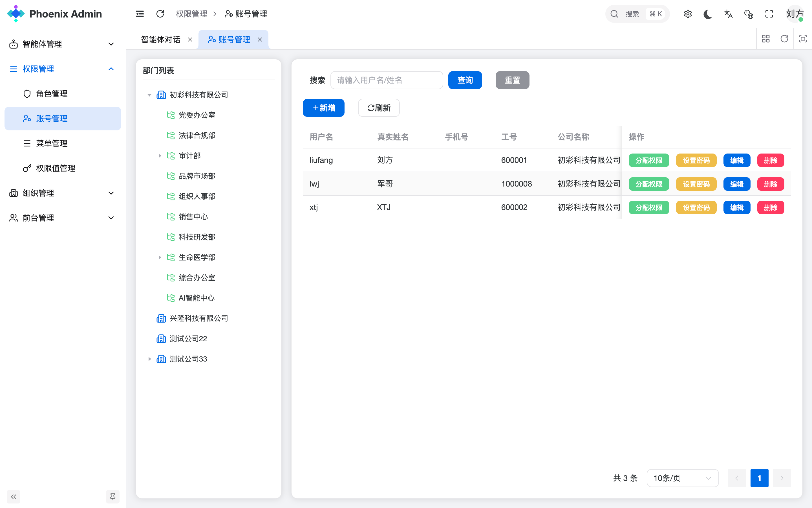

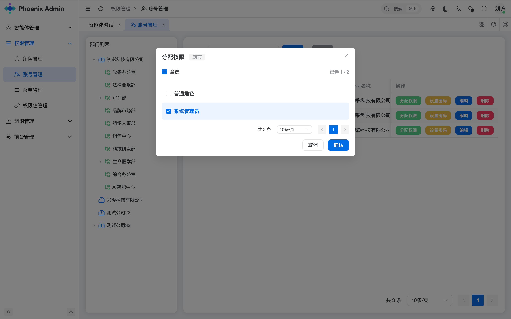

### 二级菜单：角色管理

**交互说明**：表格展示角色列表。支持按角色名称/标识搜索，可新增、编辑、删除角色，行内可分配 ACL 权限树（菜单+位运算操作权限，支持全选/取消全选）。

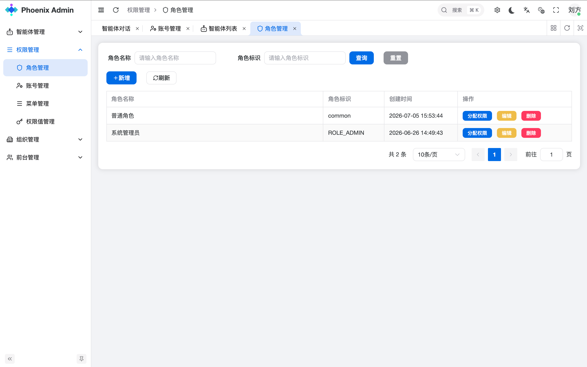

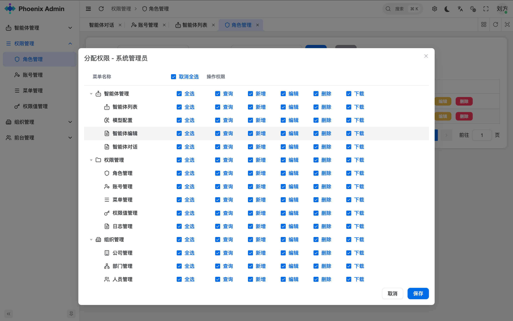

### 二级菜单：菜单管理

**交互说明**：树形表格展示菜单层级。支持按名称/标识过滤，可新增顶级或下级菜单、编辑、删除，配置路由地址、组件路径、图标、排序、类型（目录/菜单）、权限值。

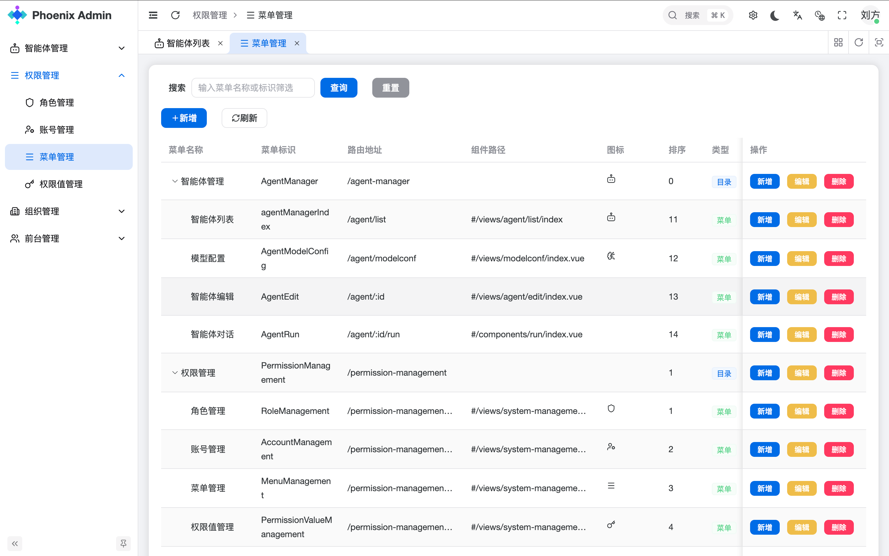

### 二级菜单：权限值管理

**交互说明**：表格展示权限值列表。支持按名称搜索，可新增、编辑、删除权限值，配置位值（0~63位运算位置）、排序号、备注。

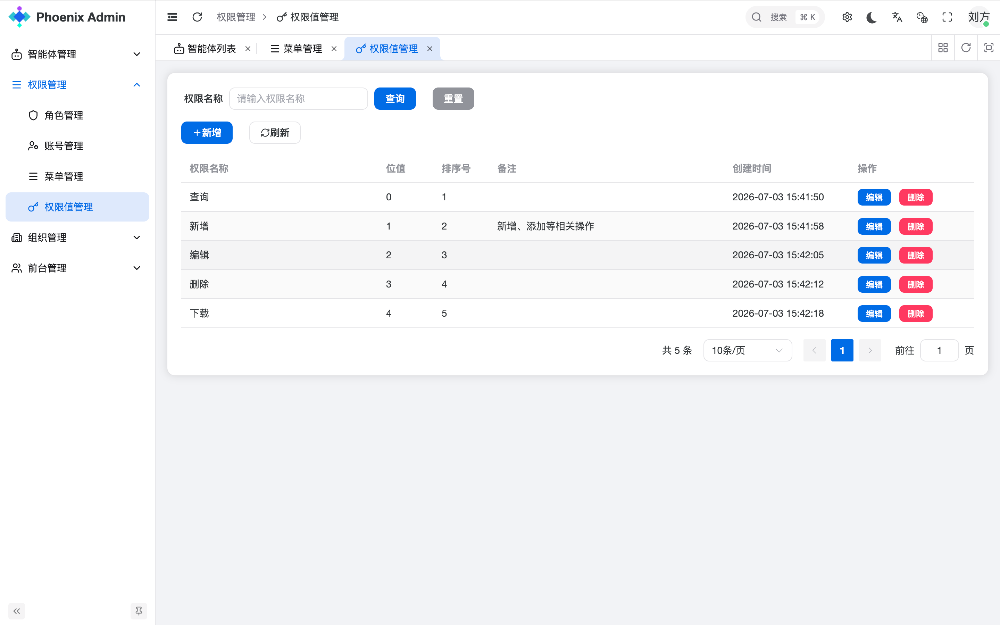

## 一级菜单：组织管理

### 二级菜单：公司管理

**交互说明**：表格展示公司列表。支持按公司名称/简称/编码搜索，可新增、编辑、删除公司，配置公司编码、简称、排序和启用状态。

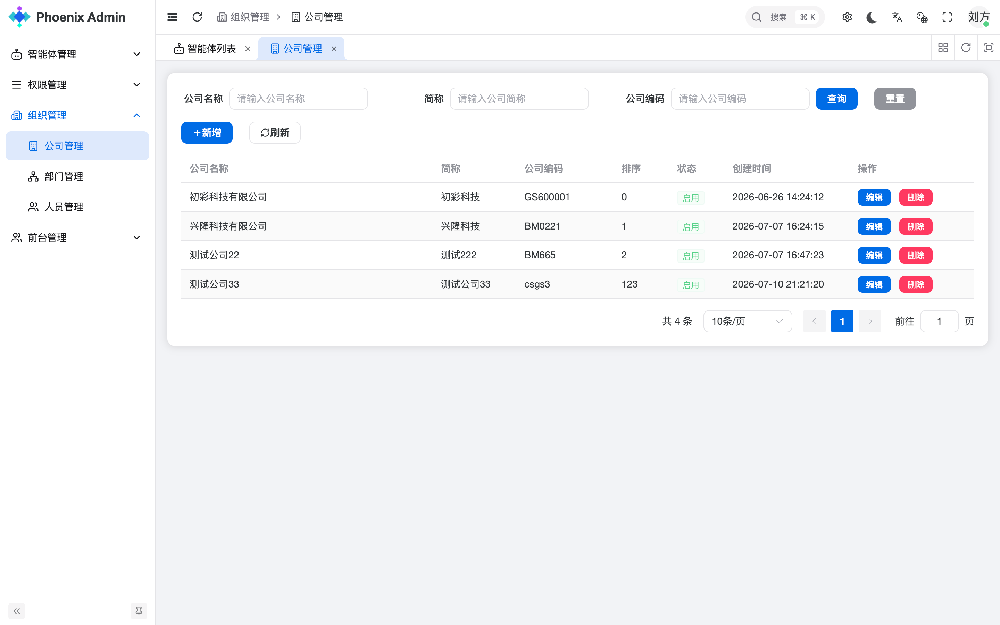

### 二级菜单：部门管理

**交互说明**：左右分栏布局，左侧公司列表点击切换，右侧树形表格展示部门层级。支持新增公司下部门或下级部门、编辑、删除，配置部门名称、编码、排序、性质（部门/组）。

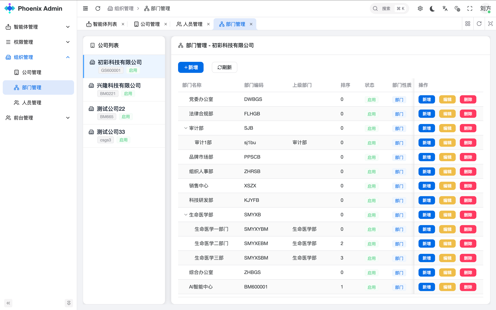

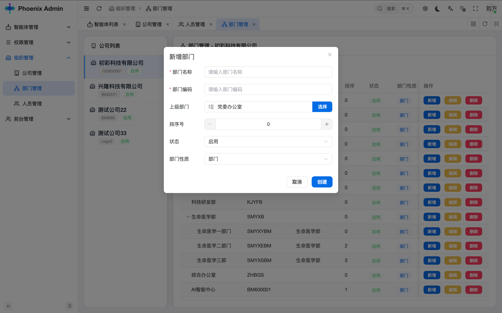

### 二级菜单：人员管理

**交互说明**：左侧部门树筛选，右侧表格展示员工信息。支持按姓名/工号/手机号搜索，可新增、编辑、删除人员，配置姓名、工号、手机号、在职状态和启用状态。

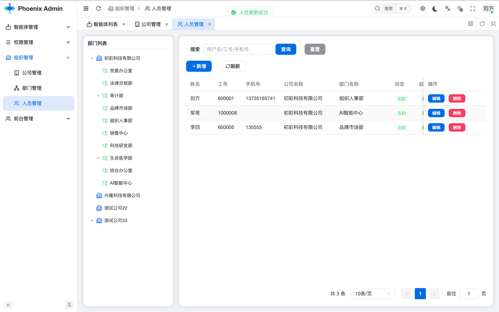

## 一级菜单：前台账号

### 二级菜单：账号管理

**交互说明**：左侧部门树筛选，右侧表格展示前台业务账号。支持按用户名/姓名/手机号和状态搜索，可新增（支持从人员库选择）、编辑、删除，行内可分配组。

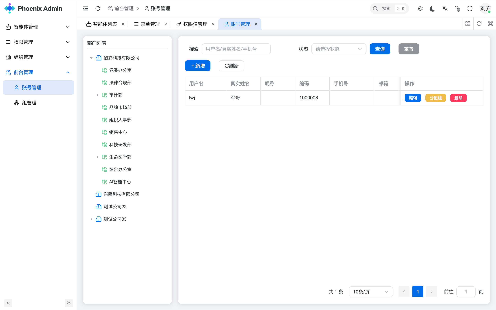

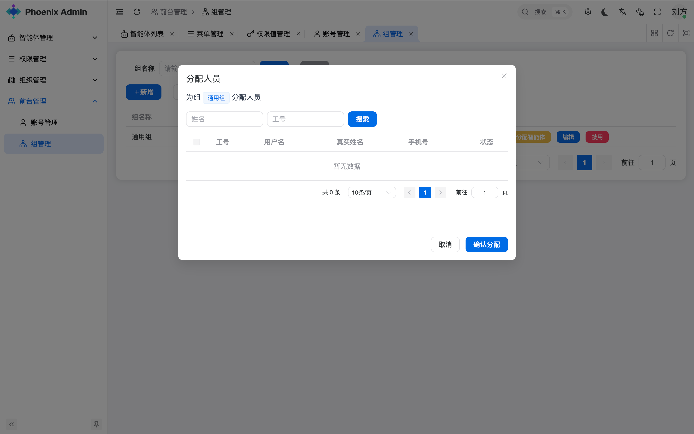

### 二级菜单：组管理

**交互说明**：表格展示组列表。支持按名称搜索，可新增、编辑、禁用组，行内可分配人员（从账号库多选）和分配智能体（从已发布 Agent 多选）。

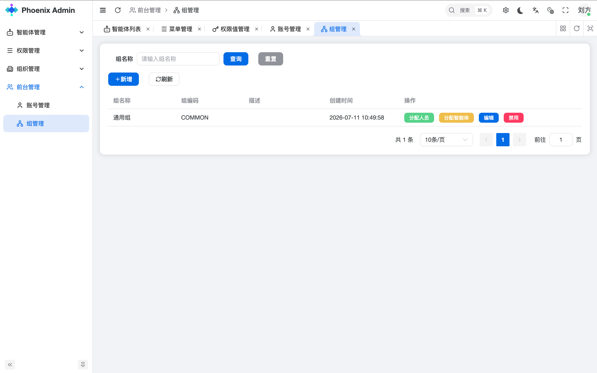

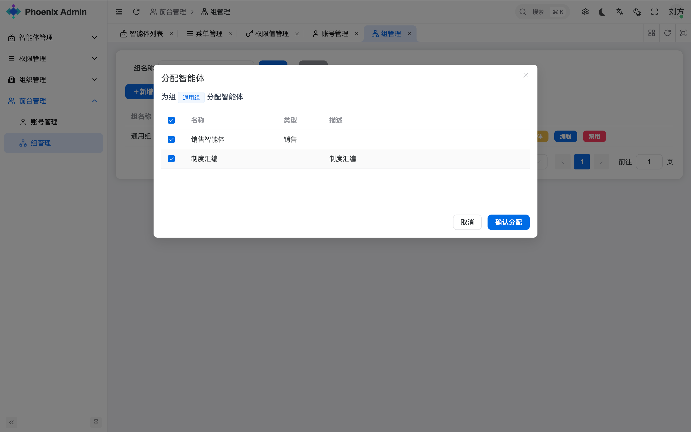
