中文 | [English](./QUICK_START-en.md)

> ⚠️ 英文版文档正在翻译中，当前请参考 [English README](../README.md)

# 快速开始

本文档将指导您完成 Phoenix 的安装、配置和首次运行。

## 📋 环境要求

- **JDK**: 21 或更高版本
- **Maven**: 3.9 或更高版本（需在 `PATH` 中）
- **PostgreSQL**: 14 或更高版本（含 pgvector 插件）
- **Redis**: 7 或更高版本
- **Docker**: （可选）用于 Python 代码执行

## 🗄️ 1. 业务数据库准备

项目 SQL 脚本位于项目根目录的 `sql/` 目录下：

- `all_schema.sql` - 完整的 Phoenix 业务表结构（PostgreSQL 语法）

将表和数据导入到你的 PostgreSQL 数据库中：

```bash
# 示例：使用 psql 命令行导入
psql -U your_user -d your_db < sql/all_schema.sql
```

## ⚙️ 2. 配置

Phoenix 项目**没有** `application.yml` / `application.properties` 文件，所有配置通过环境变量或 `@ConfigurationProperties` 默认值提供。

### 2.1 数据库与环境变量配置

| 环境变量 | 说明 | 示例 |
|---------|------|------|
| `SPRING_DATASOURCE_URL` | PostgreSQL JDBC 连接地址 | `jdbc:postgresql://127.0.0.1:5432/phoenix` |
| `SPRING_DATASOURCE_USERNAME` | 数据库用户名 | `postgres` |
| `SPRING_DATASOURCE_PASSWORD` | 数据库密码 | `postgres` |
| `SPRING_DATA_REDIS_HOST` | Redis 地址 | `127.0.0.1` |
| `SPRING_AI_DASHSCOPE_API_KEY` | DashScope/通义千问 API Key | `sk-xxx` |

### 2.2 配置模型

> 配置前缀：`spring.ai.phoenix.data-agent.*`

启动项目后，通过 API 配置模型，填写自己的 API Key 即可。
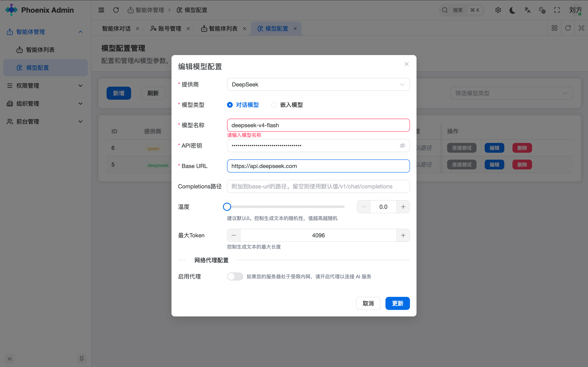
Phoenix 基于 Spring AI 架构，支持标准的 OpenAI 接口协议：

1. **标准提供商**：如 DashScope（通义千问）、OpenAI、Deepseek 等，通常只需要模型名称（Model Name）和 API Key。
2. **自定义/本地模型**（Ollama/自建网关）：请填写 `base-url`（基础地址）和 `completions-path`（请求路径）。系统会将两者拼接为完整调用地址，例如：`http://localhost:11434/v1/chat/completions`。
3. **故障排查**：如发现配置后无法调用，建议使用 Postman 对接接口地址测试连通性。

### 2.3 嵌入模型批处理策略配置

> 详细配置参数请参考 [开发者指南 - 开发配置手册](DEVELOPER_GUIDE.md#⚙️-开发配置手册)。

### 2.4 向量库配置

系统默认使用 PostgreSQL pgvector 作为向量库（通过 `PgVectorStore` 配置），同时支持 Elasticsearch 作为备选向量存储方案。

#### 2.4.1 向量库依赖

默认已集成 PGvector，无需额外引入。如需切换为其他向量库，在 `pom.xml` 中添加对应的 Starter：

```xml
<dependency>
    <groupId>org.springframework.ai</groupId>
    <artifactId>spring-ai-starter-vector-store-pgvector</artifactId>
</dependency>
```

详细对应的向量库参考文档：https://springdoc.cn/spring-ai/api/vectordbs.html

#### 2.4.2 向量库 Schema 设置

以下为 ES 的 Schema 结构，其他向量库（如 Milvus, PGVector）可参考此结构：

```json
{
  "mappings": {
    "properties": {
      "content": {
        "type": "text",
        "fields": {
          "keyword": {
            "type": "keyword",
            "ignore_above": 256
          }
        }
      },
      "embedding": {
        "type": "dense_vector",
        "dims": 1024,
        "index": true,
        "similarity": "cosine",
        "index_options": {
          "type": "int8_hnsw",
          "m": 16,
          "ef_construction": 100
        }
      },
      "id": {
        "type": "text",
        "fields": {
          "keyword": {
            "type": "keyword",
            "ignore_above": 256
          }
        }
      },
      "metadata": {
        "properties": {
          "agentId": {
            "type": "text",
            "fields": {
              "keyword": {
                "type": "keyword",
                "ignore_above": 256
              }
            }
          },
          "agentKnowledgeId": { "type": "long" },
          "businessTermId": { "type": "long" },
          "concreteAgentKnowledgeType": {
            "type": "text",
            "fields": {
              "keyword": {
                "type": "keyword",
                "ignore_above": 256
              }
            }
          },
          "vectorType": {
            "type": "text",
            "fields": {
              "keyword": {
                "type": "keyword",
                "ignore_above": 256
              }
            }
          }
        }
      }
    }
  }
}
```

#### 2.4.3 向量库配置参数
> 详细配置参数请参考 [开发者指南 - 开发配置手册](DEVELOPER_GUIDE.md)。

### 2.5 检索融合策略

> 详细配置参数请参考 [开发者指南 - 开发配置手册](DEVELOPER_GUIDE.md)。

## 🚀 3. 启动服务

### 方式 ：统一管理平台（phoenix-admin-manager，端口 8066，推荐）

主应用位于 `phoenix-admin/phoenix-admin-manager` 模块，入口类为 `PhoenixAgentApplication`。

```bash
mvn spring-boot:run -pl phoenix-admin/phoenix-admin-manager
```

此方式聚合了智能报表、智能体管理、权限认证、平台管理等所有模块，提供统一的企业级服务。

### 健康检查

启动成功后，访问：

```bash
curl http://localhost:8080/
```

### 流式查询 API

```bash
# SSE 流式查询
curl -N "http://localhost:8080/api/stream/search?agentId=1&query=上个月销售额是多少"
```

## 🎯 4. 系统体验
### 4.1 登录
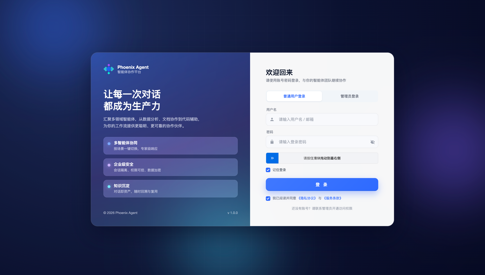
### 4.2 数据智能体的创建与配置

Phoenix 提供 REST API 进行智能体的创建与管理。
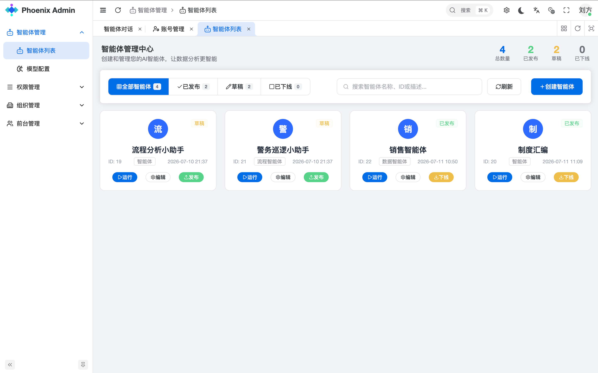
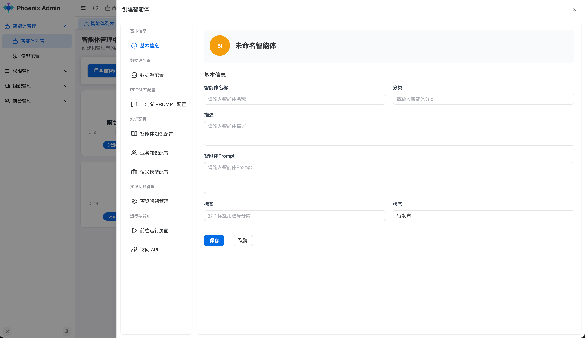

#### 配置数据源

通过 API 配置业务数据库（我们在环境初始化时提供的业务数据库）。支持 PostgreSQL、MySQL、Oracle、SQL Server、H2、Hive、达梦等多种数据源。
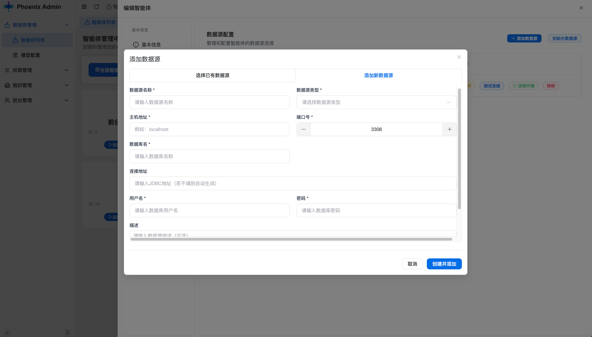
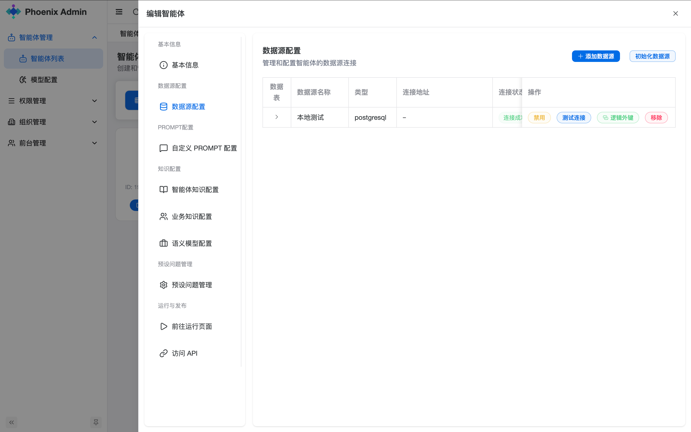
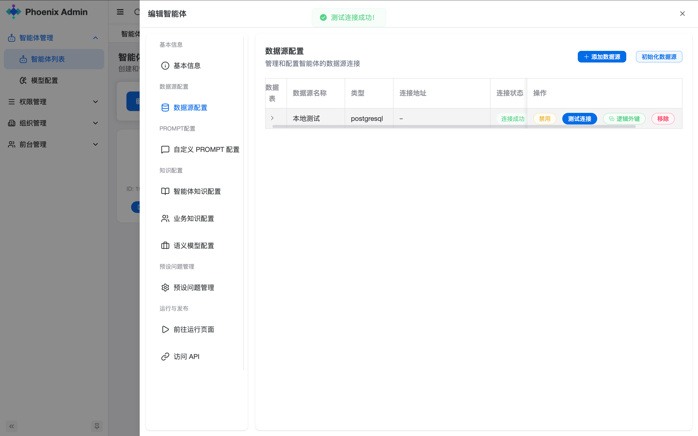
#### 配置预设问题

预设问题管理，可以为智能体设置预设问题，方便快速测试。
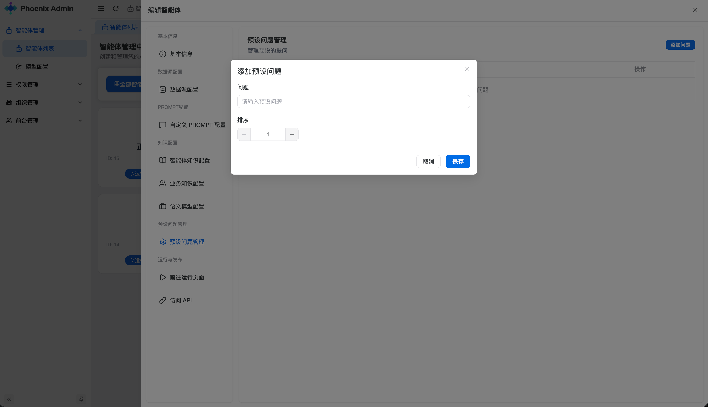
#### 配置语义模型

语义模型库定义业务术语到数据库物理结构的精确转换规则，存储字段名的映射关系。
例如 `customerSatisfactionScore` 对应数据库中的 `csat_score` 字段。
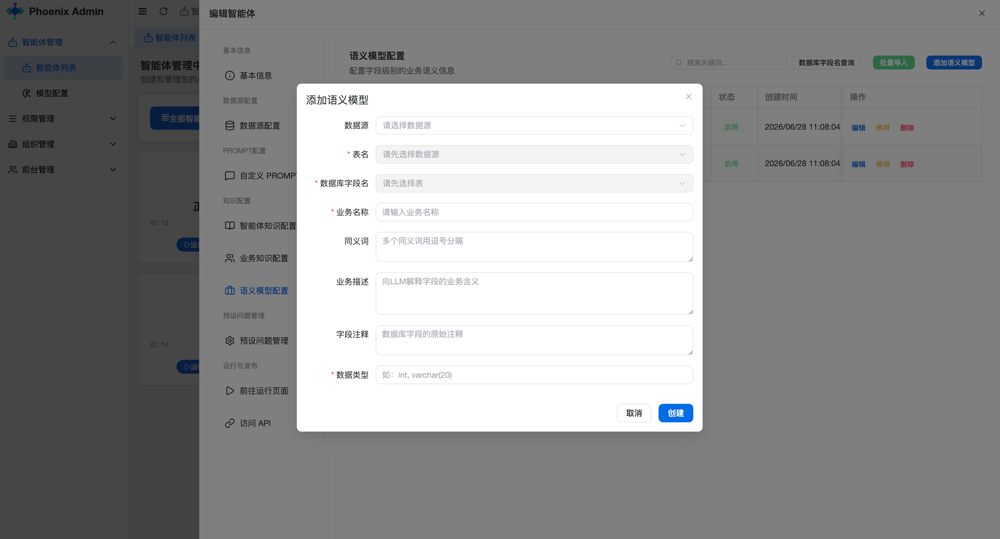
#### 配置业务知识

业务知识定义了业务术语和业务规则，例如 GMV = 商品交易总额，包含付款和未付款的订单金额。
业务知识可以设置为召回或者不召回，配置完成后需要同步到向量库。
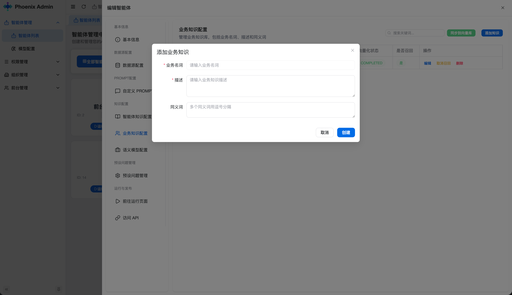
#### 配置智能体知识库

支持上传文档（PDF、DOCX、Markdown）或添加问答对（Q&A），为智能体提供 RAG 增强。
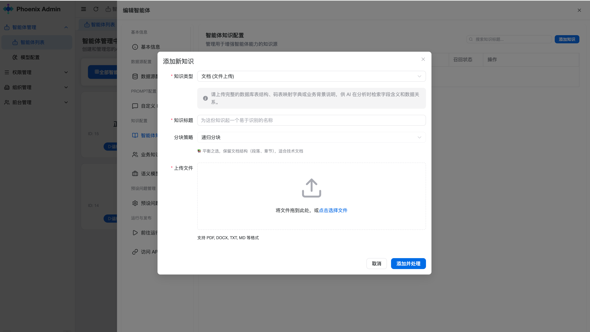
### 4.3 数据智能体的运行
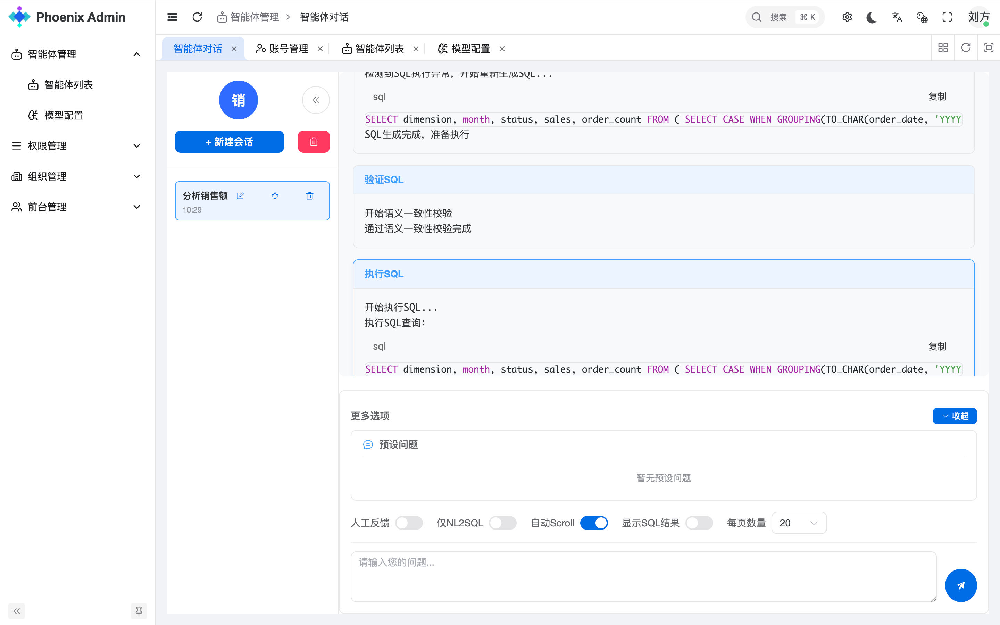
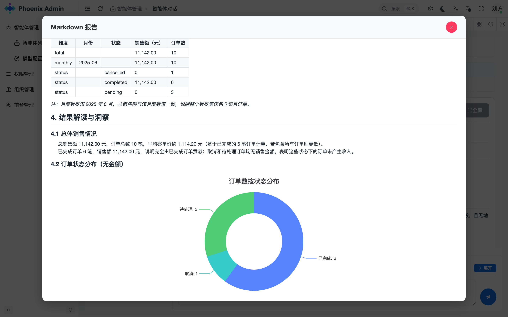

#### 4.4 用户端智能体
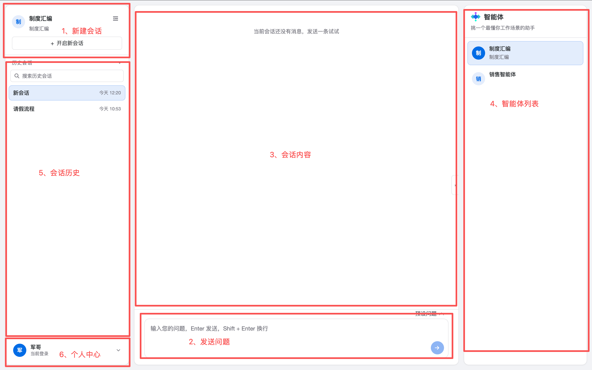

#### 运行模式

- **默认模式**：智能体自动生成计划并执行，对 SQL 执行结果进行解析，生成报告。
- **人工反馈模式**（`humanFeedback=true`）：智能体生成计划后等待用户确认，可选择更改计划或执行计划。
- **仅 NL2SQL 模式**（`onlyNL2Sql=true`）：只生成 SQL 并获取结果，不会生成报告。
- **显示 SQL 运行结果**（`showSqlResult=true`）：在生成 SQL 并执行后将结果展示给用户。
- **简洁报告模式**（`simpleReport=true`）：生成简洁版分析报告。

## 📚 下一步

- 了解[架构设计](ARCHITECTURE.md)以深入理解系统原理
- 查看[高级功能](ADVANCED_FEATURES.md)了解更多高级特性
- 阅读[开发者文档](DEVELOPER_GUIDE.md)参与项目贡献
