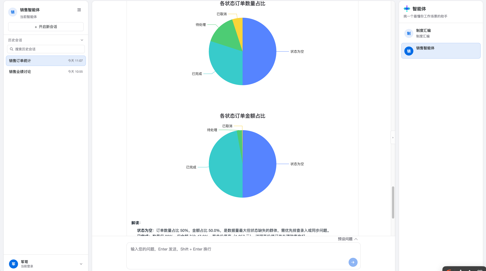
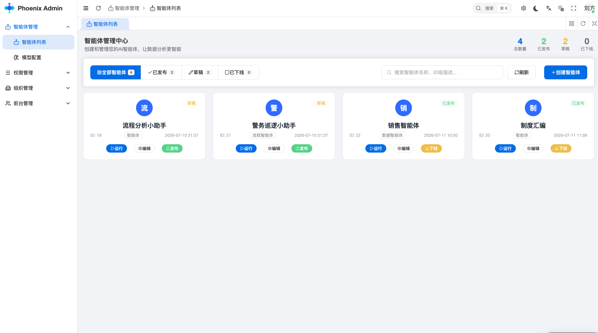

<div align="center">
  
  <br>
  <h1>Phoenix Admin</h1>
</div>

[中文](./README.zh-CN.md) | **English**

## Introduction

Phoenix Admin is a free and open-source Multi-Agent management platform built with Vue 3, Vite, and TypeScript. It's ready to use out of the box, suitable for enterprise AI applications, personal projects, and learning.

## Features

- **Modern Stack**: Built with Vue 3, Vite, TypeScript, and other cutting-edge technologies
- **TypeScript**: Fully typed with comprehensive type definitions
- **Multi-Theme**: Built-in theme switching with customizable color schemes
- **Internationalization**: Full i18n support with multi-language switching
- **Permission Management**: Built-in dynamic route-based permission system
- **Multi-Agent Interaction**: Integrated AI capabilities including NL2SQL, smart chat, and more

## Preview

<div align="center">
  
  
  
</div>

## Install & Usage

1. Clone the repository

```bash
git clone https://github.com/liu463805737-collab/phoenix.git
```

2. Install dependencies

```bash
cd web-frontend
npm i -g corepack
pnpm install
```

3. Start dev server

```bash
cd web-frontend/apps/admin-ui
pnpm dev
```

4. Build

```bash
cd web-frontend/apps/admin-ui
pnpm build
```

## How to Contribute

Welcome to submit an [Issue](https://codeup.aliyun.com/608787900f167f18d198f318/phoenix/issues) or Pull Request.

**Pull Request Process:**

1. Fork this repository
2. Create your feature branch: `git checkout -b feature/xxxx`
3. Commit your changes: `git commit -am 'feat(function): add xxxxx'`
4. Push the branch: `git push origin feature/xxxx`
5. Submit a Pull Request

## Git Commit Convention

Follows [Angular Commit Convention](https://github.com/conventional-changelog/conventional-changelog/tree/master/packages/conventional-changelog-angular):

- `feat` — New feature
- `fix` — Bug fix
- `style` — Code formatting (no functional change)
- `perf` — Performance improvement
- `refactor` — Code refactoring
- `revert` — Revert changes
- `test` — Tests
- `docs` — Documentation
- `chore` — Dependencies / configuration
- `ci` — Continuous integration
- `types` — Type definition changes

## Browser Support

Tailwind CSS v4.0 supports Safari 16.4+, Chrome 111+, and Firefox 128+.

Modern browsers only; IE is not supported.

| [](http://godban.github.io/browsers-support-badges/)</br>Edge | [](http://godban.github.io/browsers-support-badges/)</br>Firefox | [](http://godban.github.io/browsers-support-badges/)</br>Chrome | [](http://godban.github.io/browsers-support-badges/)</br>Safari |
| :-: | :-: | :-: | :-: |
| last 2 versions | last 2 versions | last 2 versions | last 2 versions |

## License

[MIT © Phoenix 2026](./LICENSE)
